<div align="center">

# The Chosen One

**A mobile-first PWA party game: everyone places a finger on the screen, the app randomly picks a player, and they choose Truth or Dare.**

<p>
  <a href="https://vibecode.tours/team-08-app/">
    
  </a>
</p>

 

**🔗 Live:** https://vibecode.tours/team-08-app/

</div>

---

## Table of Contents

- [Overview](#overview)
- [Screenshots](#screenshots)
- [Features](#features)
- [Quickstart](#quickstart)
- [Usage](#usage)
- [Game Flow](#game-flow)
- [Stack](#stack)
- [Project Structure](#project-structure)
- [Contributing](#contributing)

---

## Overview

The Chosen One is a fully client-side, share-the-phone party game. 2–10 players place their fingers on the screen, a roulette spins across them, and one finger is chosen. That player then picks Truth or Dare, reveals a card, and performs the challenge — no backend, no accounts, just the phone and the group.

## Screenshots

<p align="center">
  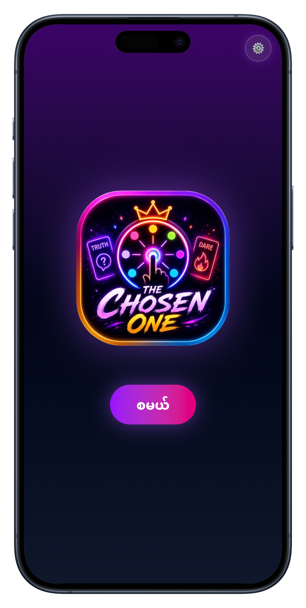
  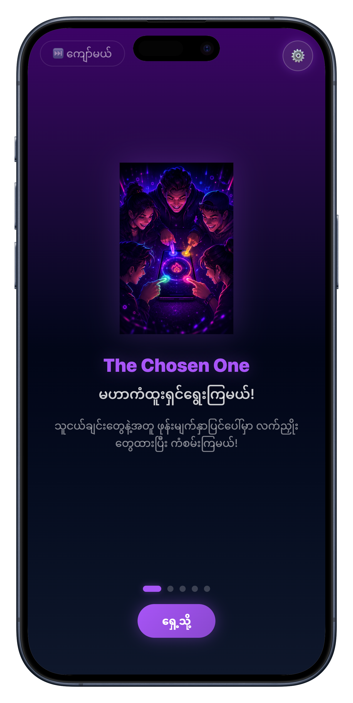
  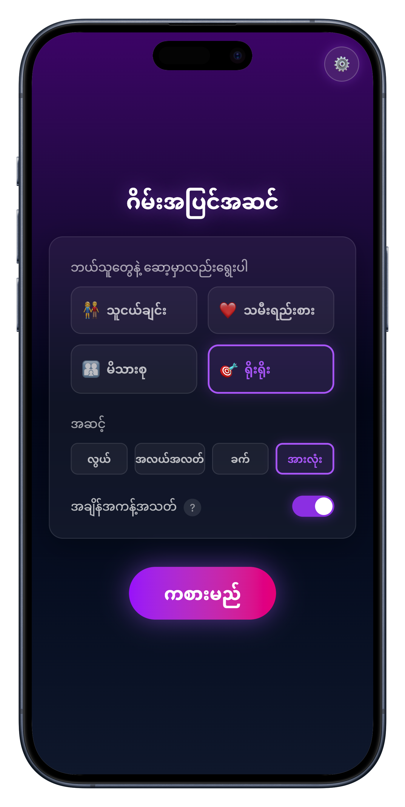
  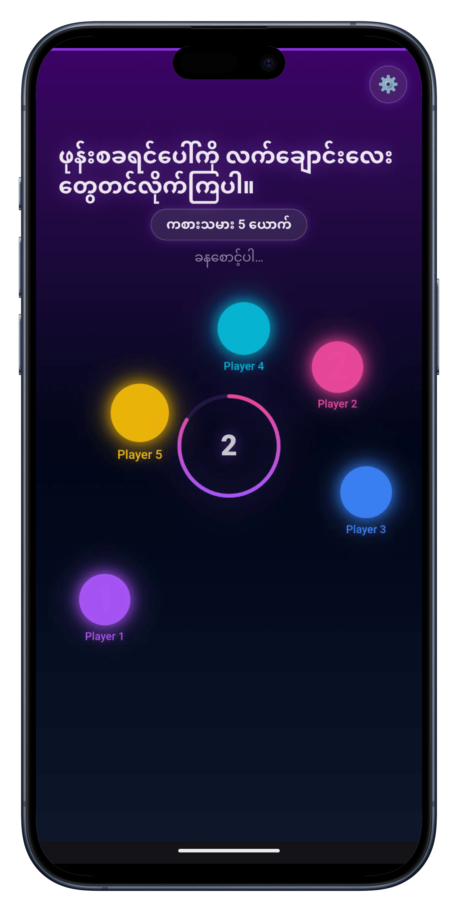
  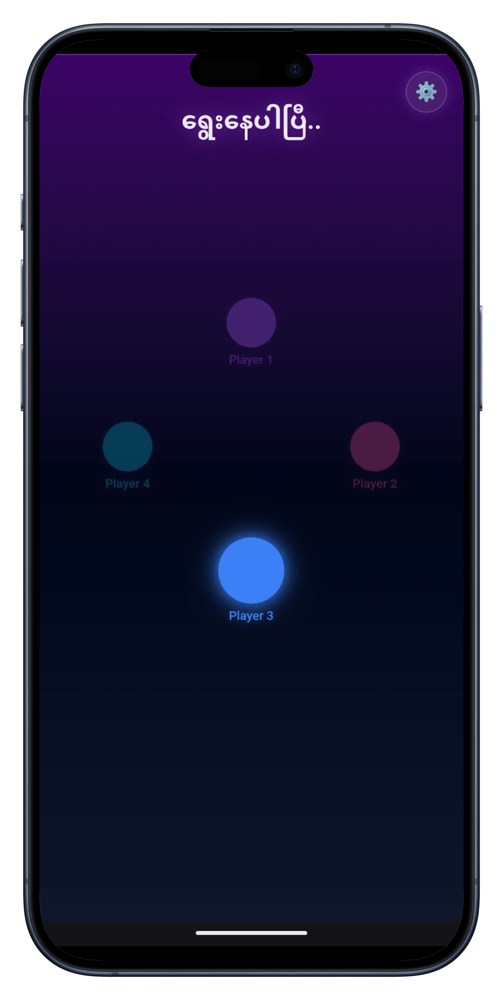
</p>
<p align="center">
  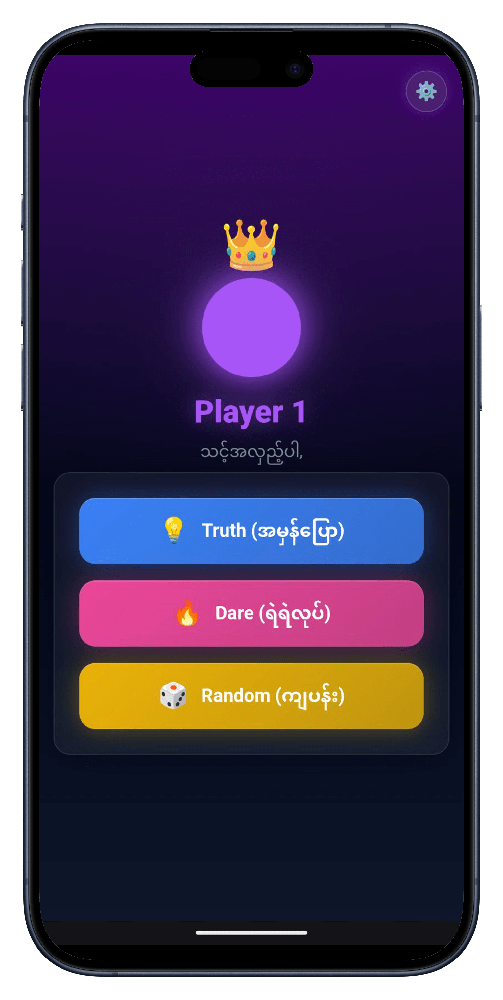
  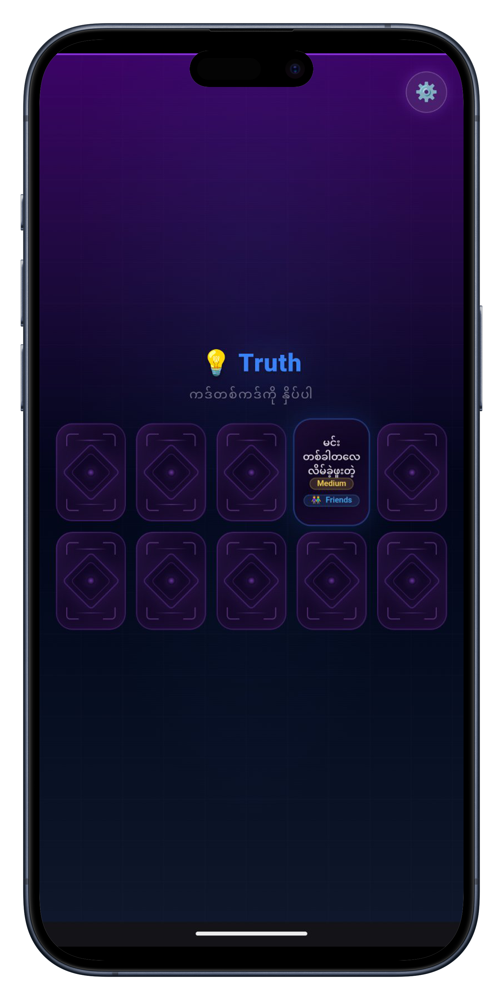
  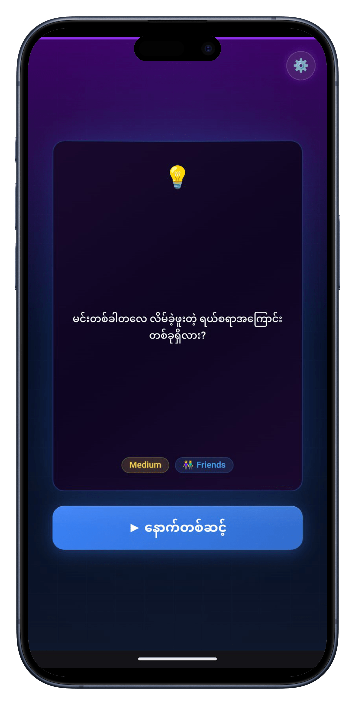
  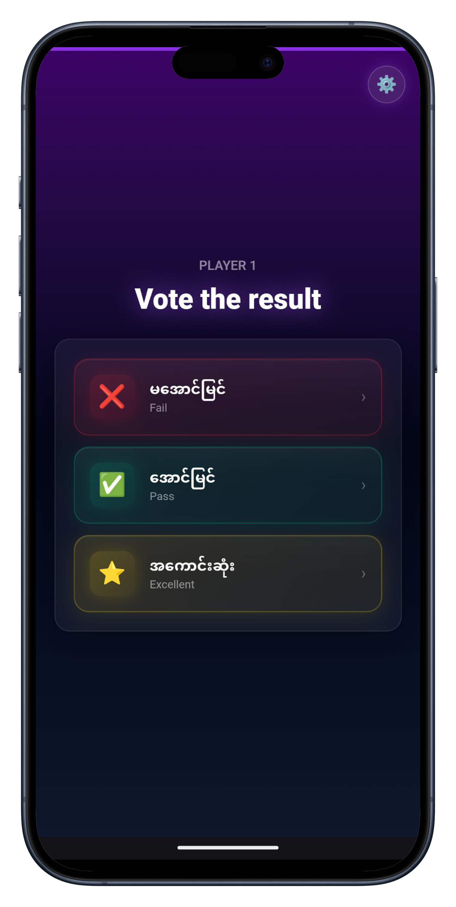
  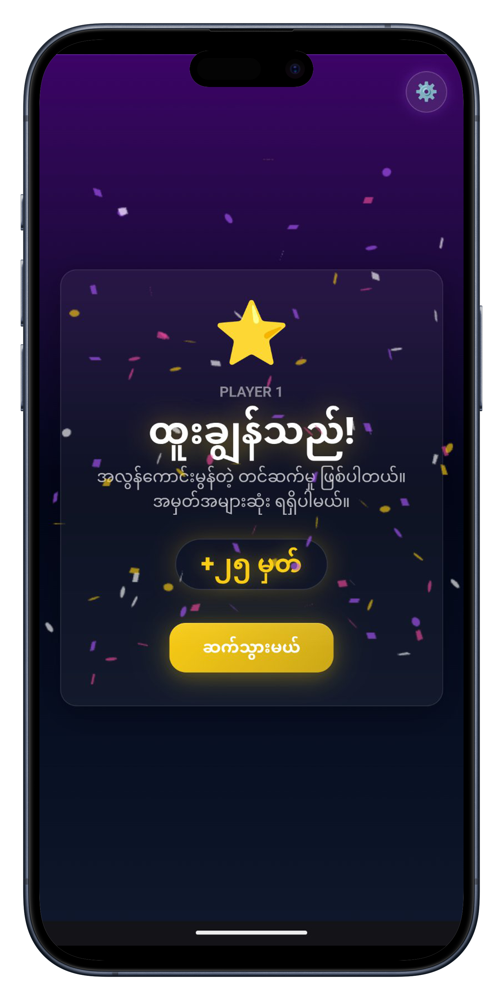
</p>
<p align="center">
  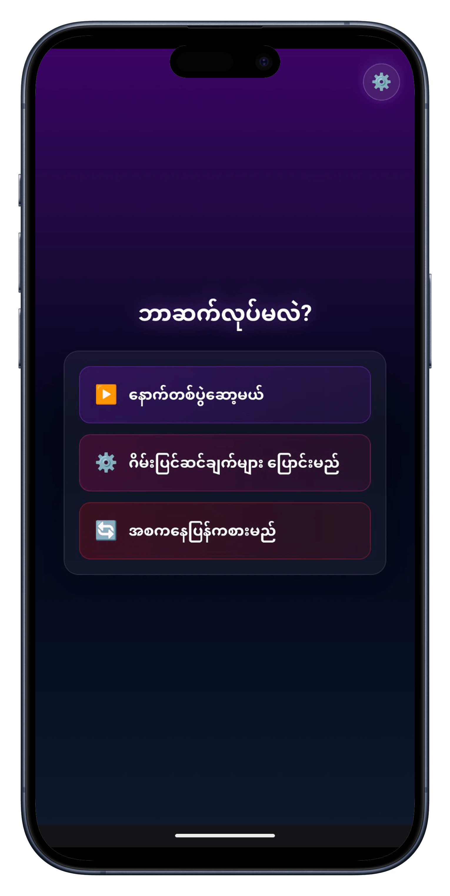
</p>

## Features

- **Multi-touch roulette** — 2–10 players place fingers on screen, a spinning light selects one winner
- **Truth or Dare** — selected player chooses Truth, Dare, or Random (with coin-flip animation)
- **Card selection** — grid of face-down cards with 3D flip animation revealing challenges
- **192 cards** across 4 packs (Friends, Couple, Family, Classic) × 3 difficulties (Easy, Medium, Hard)
- **Voting** — Fail / Pass / Excellent with confetti celebration effects
- **Sound effects & music** — 12 SFX (Web Audio API) + 3 BGM tracks with crossfading
- **No-repeat selection** — same player can't be picked twice in a row
- **Settings** — difficulty, card pack, timer toggle, sound & music toggles
- **Onboarding** — swipeable walkthrough for first-time players
- **Desktop support** — click-to-add players on non-touch devices, QR code for mobile handoff
- **Error boundary** — catches render crashes with a friendly recovery screen
- **PWA updates** — tap-to-reload toast when a new version is available
- **PWA install** — one-tap install button in settings (Android/Chrome), manual hint for iOS
- **Smooth transitions** — animated screen transitions via AnimatePresence
- **Myanmar (Burmese)** — all UI text localized

## Quickstart

```bash
git clone https://github.com/vibe-code-tours/team-08-app.git && cd team-08-app
cp .env.example .env        # fill in real values LOCALLY — never commit .env
npm install && npm run dev
```

## Usage

```bash
npm run dev        # Start dev server (http://localhost:5173)
npm run build      # Production build to dist/
npm run preview    # Preview production build locally
npm run lint       # Run ESLint
npm run test       # Run Vitest
```

## Game Flow

```
Start → Onboarding → Setup → Finger Selection → Roulette
    → Player Selected (Truth/Dare/Random choice) → Card Reveal
    → Voting → Result → Next Round ↩
```

> **Note:** Player Selected and Truth/Dare choice are combined into a single screen for a smoother flow.

## Stack

| Layer | Technology |
|-------|-----------|
| **Framework** | React 19 + TypeScript |
| **Build** | Vite 8 |
| **Styling** | Tailwind CSS v4 (neon cyber theme) |
| **Animation** | Motion (Framer Motion) |
| **Audio** | Web Audio API (SFX) + HTML5 Audio (BGM) |
| **PWA** | vite-plugin-pwa (installable, offline-capable) |
| **Testing** | Vitest + Testing Library |
| **Lint** | ESLint (TS + React hooks + refresh) |
| **Deploy** | GitHub Pages (auto-deploy on push to `main`) |

## Project Structure

| Path | What |
|------|------|
| `src/screens/` | 11 screen components, one per game phase |
| `src/components/` | 13 reusable components (NeonButton, GlassPanel, ErrorBoundary, PhaseMusic, UpdateToast, etc.) |
| `src/state/GameContext.tsx` | Game state, reducer (12 actions), settings persistence |
| `src/hooks/useMultiTouch.ts` | Multi-touch tracking (keyed by `touch.identifier`) |
| `src/hooks/useSound.ts` | Web Audio API SFX manager with preloading |
| `src/hooks/useTouchCapability.ts` | Non-touch device detection (feature detection only) |
| `src/hooks/usePwaInstall.ts` | PWA install prompt capture and trigger |
| `src/utils/selectPlayer.ts` | No-repeat player selection logic |
| `src/data/cards.ts` | 192 static Truth/Dare cards with filtering helpers |
| `src/types/` | TypeScript types (Card, GameState, PlayerTouch, etc.) |
| `docs/` | Architecture, ADRs, spike results |
| `.planning/` | Roadmap, requirements, GSD planning docs |

## Contributing

**Start here:** [`docs/ARCHITECTURE.md`](docs/ARCHITECTURE.md) for the system diagram, [`docs/decisions/`](docs/decisions) for ADRs, and [`.planning/PROJECT.md`](.planning/PROJECT.md) + [`.planning/ROADMAP.md`](.planning/ROADMAP.md) for project context and phase status.

- Branch → PR → 1 teammate review → merge
- Branch naming: `feat/...` or `fix/...` off `main`
- No push to `main` directly — branch protection requires PR + review
- Commit messages: conventional style (`feat:`, `fix:`, `docs:`, `ci:`, ...)
- Keep PRs under ~300 lines where possible
- Code style: functional components (`function`, not arrow), one component per file, `import type` for type-only imports — see [`CLAUDE.md`](CLAUDE.md) for the full conventions
- Run `npm run lint && npm run test && npm run build` before opening a PR
- CI must be green before merging

---

<div align="center">

*Built with [Vibe Code Tours](https://vibe-code-tours.com/) — AI-assisted collaborative development.*

</div>
